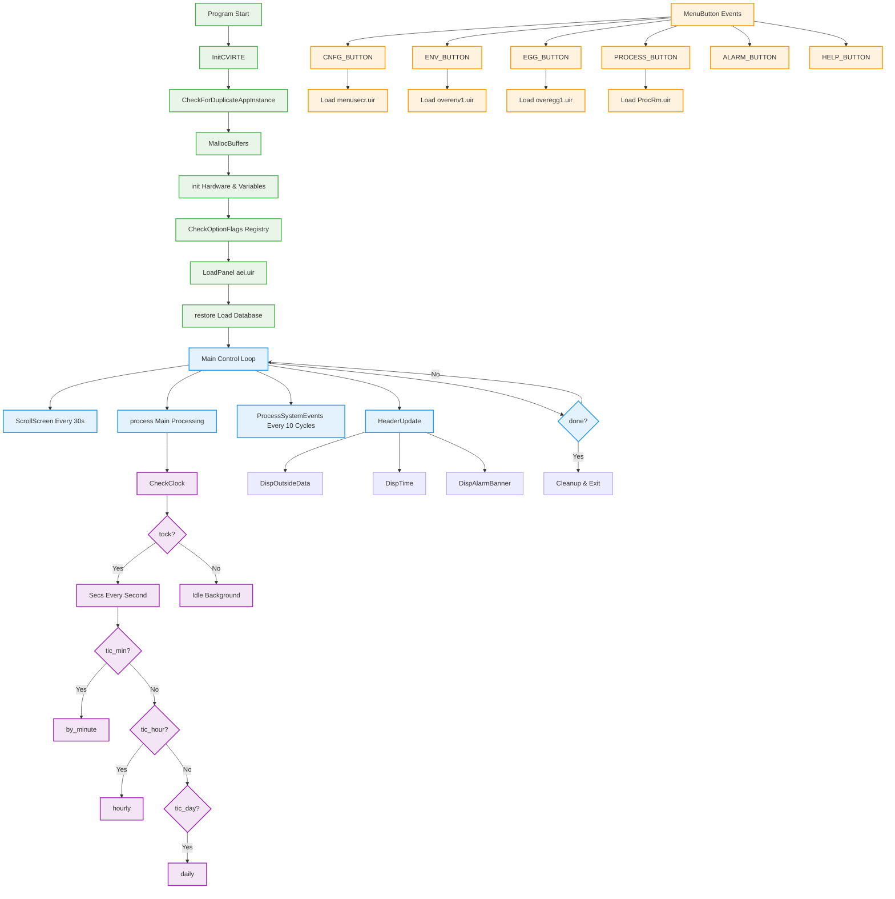
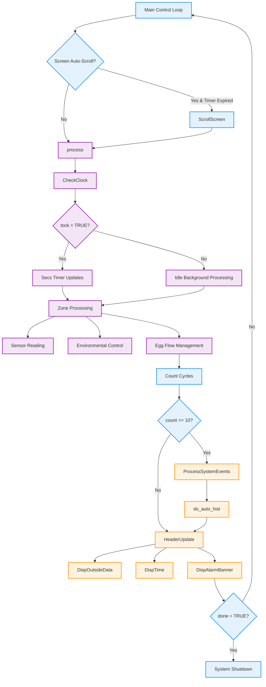
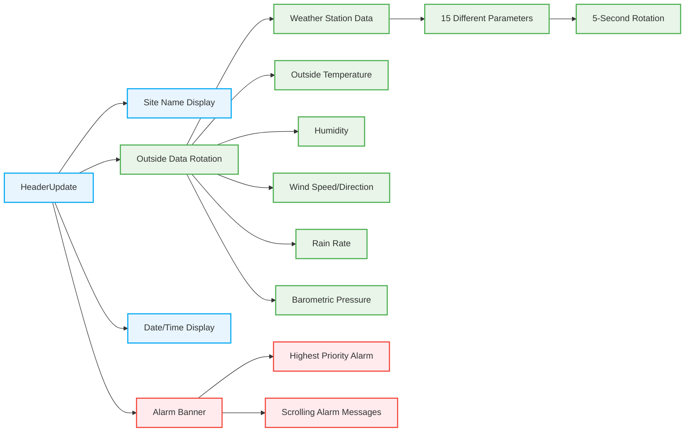
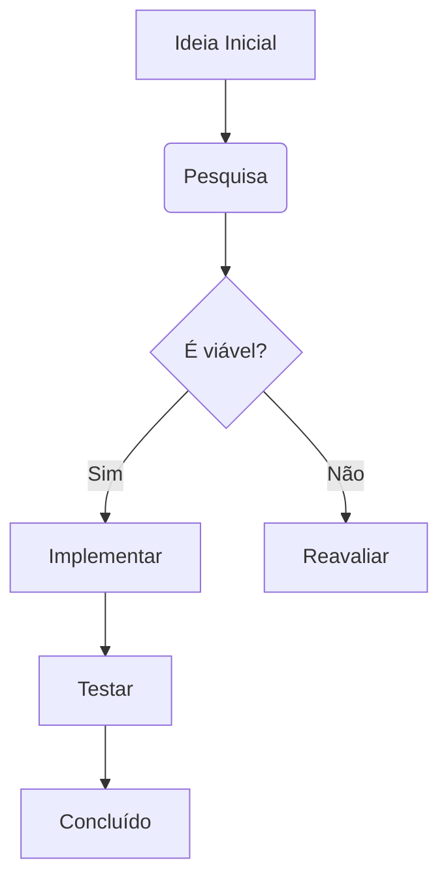

# 📋 **MAIN.C - Detailed Architecture Explanation**

**MAIN.C** is the **master control center** and **application orchestrator** for the AEI Integra poultry automation system. It serves as the **entry point, UI manager, and main coordinator** for all system operations.

## 🚀 **System Architecture Overview:**

### **Phase 1: System Initialization (Lines 705-843)**

**1️⃣ Runtime Initialization:**
```c
InitCVIRTE(0, argv, 0)           // Initialize CVI runtime environment
CheckForDuplicateAppInstance()    // Prevent multiple instances
```

**2️⃣ Memory & Hardware Setup:**
```c
MallocBuffers()                  // Allocate heap memory for data structures
init()                          // Initialize hardware, comm ports, variables
CheckOptionFlags()              // Read registry settings and user preferences
```

**3️⃣ User Interface Setup:**
```c
LoadPanel(0, "aei.uir", PANEL)  // Load main GUI panel
DisplayPanel(mainPanel)          // Show main interface
restore()                       // Load historical database from disk
```

### **Phase 2: Main Control Loop (Lines 890-916)**


### **Phase 3: User Interface Management**

**🎛️ Menu Button System (`MenuButton()` Function):**

Each button loads different operational screens:

| Button | Panel Loaded | Function |
|--------|--------------|----------|
| **CNFG** | `menusecr.uir` | System configuration |
| **ENV** | `overenv1.uir` / `overenv8.uir` | Environmental overview |
| **FW** | `overf&w.uir` / `overf&w8.uir` | Feed & Water overview |
| **EGG** | `overegg1.uir` / `overegg8.uir` | Egg production overview |
| **PROCESS** | `ProcRm.uir` | Grader processing status |
| **ALARM** | `alarm.uir` | Alarm management |
| **TREND** | `trend.uir` | Historical trends |
| **UTILITY** | Via DLL | Utility systems |
| **QUALITY** | Via DLL | Quality control |

### **Phase 4: Real-Time Display Management**

**📊 Header Information System (`HeaderUpdate()`):**



**🌡️ Outside Data Display (`DispOutsideData()`):**

Cycles through **15+ different weather parameters** every 5 seconds:
- **Outside Temperature** (with negative handling)
- **Humidity** (relative humidity %)  
- **Rain Rate** (inches/hour)
- **Wind Speed & Direction** (MPH + compass direction)
- **Barometric Pressure** (inches Hg)
- **Heat Index & Wind Chill** (calculated values)
- **Dewpoint & Sunrise/Sunset** times

### **Phase 5: System Integration Points**

**🔗 Key Integration Calls:**

```c
// Main processing engine (from PROCESS.C)
process()                    // Manages all zones, sensors, outputs

// Time-based functions (from TIMELY.C)  
Secs()                      // Every second: timers, counters
by_minute()                 // Every minute: averages, control
hourly()                    // Every hour: history, reports  
daily()                     // Every day: summaries, cleanup

// Serial communication (from LOOP.C)
SendSerialData()            // DGP communication management

// Historical data (from other modules)
do_auto_hist()             // Automatic history file generation
```

### **Phase 6: Specialized System Variants**

**🎯 Conditional Compilation Features:**

| Build Flag | Purpose | Key Features |
|------------|---------|--------------|
| **VIEW** | Remote Viewer | Read-only monitoring system |
| **NETVAR** | Network Variable | NetVar protocol support |
| **DASHBOARD** | Web Dashboard | Real-time web interface |
| **V204/V205** | Version Variants | Support for 2-5 graders |
| **PROCVIEW** | Processing Only | Limited to processing screen |

### **Phase 7: Advanced Features**

**🎛️ Screen Auto-Rotation (`ScrollScreen()`):**
- **30-second timer** automatically switches between screens
- **Environmental Overview** → **Processing** → **Egg Flow**
- Configurable via `logic_defs[10]->xtra_2` bit setting

**⌨️ Keyboard Shortcuts (`MainProcess()`):**
- **F1**: Help system
- **F8**: Message notepad  
- **F10**: Processing screen
- **Ctrl+C**: Stop current printing
- **Ctrl+P**: Print active panel

**🔧 Registry-Based Configuration:**
```c
CheckOptionFlags()          // Reads from HKEY_CURRENT_USER
// Enables/disables: Quality, Utility, Reports, Debug modes
// Configures: Printer settings, Resolution adjustment
// Controls: Menu visibility, Keypad support
```

## 📈 **Performance Characteristics:**

- **Main Loop**: Executes continuously (~10ms cycles)
- **UI Updates**: Every 10th cycle to balance performance
- **Display Refresh**: Headers updated selectively vs. full refresh
- **Memory Management**: Static allocation for real-time performance
- **Event Processing**: Non-blocking UI event handling

**MAIN.C** essentially functions as the **operating system kernel** for the poultry automation system, coordinating between **hardware I/O**, **user interface**, **data processing**, and **communication systems** while maintaining **real-time performance** critical for industrial automation.



